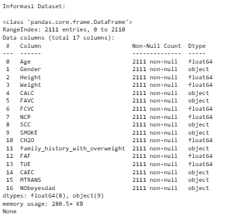
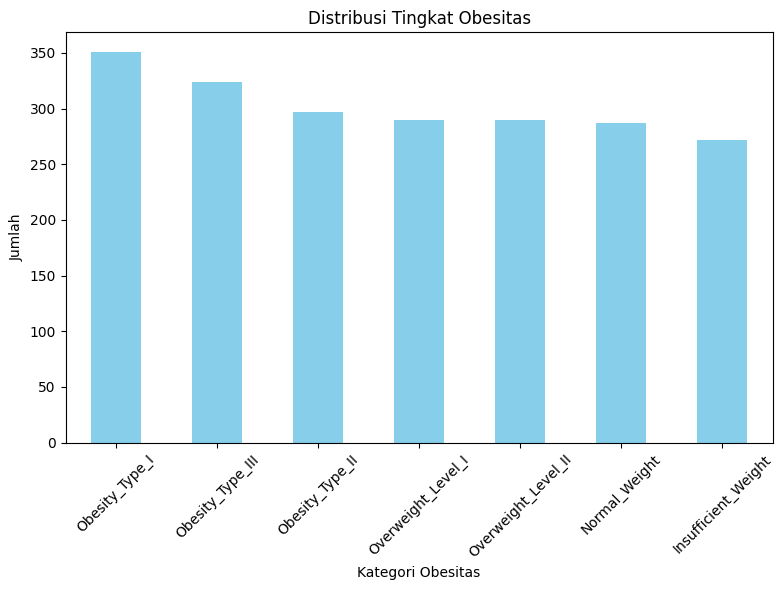
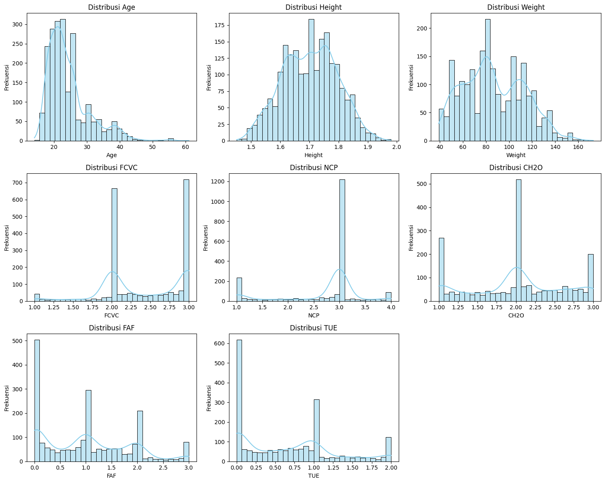
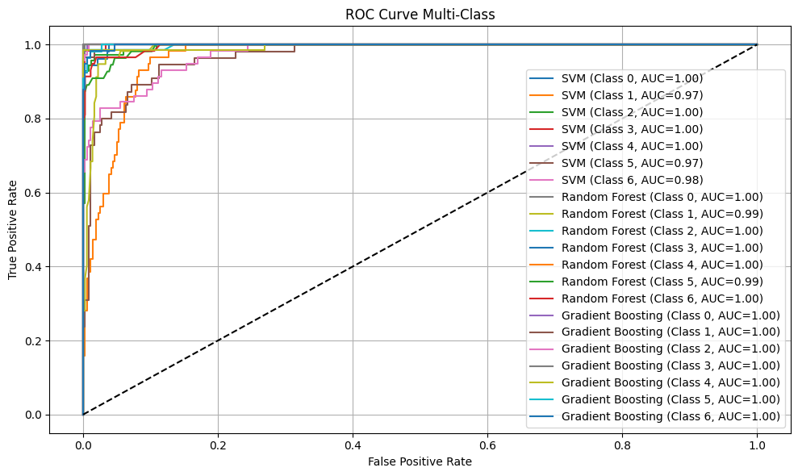

# Laporan Proyek Machine Learning - Zaenal Syamsyul Arief

## Domain Proyek

Masalah obesitas merupakan isu kesehatan global yang semakin meningkat akibat pola makan tidak sehat, kurangnya aktivitas fisik, serta faktor genetik dan psikologis. Obesitas meningkatkan risiko berbagai penyakit kronis seperti diabetes tipe 2, penyakit jantung, hipertensi, dan gangguan sendi. Dalam proyek ini, dikembangkan model machine learning untuk memprediksi tingkat obesitas seseorang berdasarkan berbagai fitur gaya hidup dan faktor fisiologis.

Menurut [MedlinePlus](https://medlineplus.gov/ency/patientinstructions/000348.htm), pengendalian berat badan dapat dilakukan dengan memperbaiki pola makan, meningkatkan aktivitas fisik, dan perubahan perilaku. Upaya deteksi dini terhadap risiko obesitas dapat menjadi langkah preventif yang sangat penting.

Studi terbaru oleh Saputra dkk. [1] menekankan pentingnya aktivitas fisik dalam mempengaruhi indeks massa tubuh (BMI) dan menunjukkan bahwa algoritma machine learning, seperti naive Bayes dan random forest, mampu memprediksi status obesitas berdasarkan data gaya hidup dengan akurasi yang cukup menjanjikan. Penelitian tersebut juga menggarisbawahi bahwa metode machine learning berpotensi mengidentifikasi faktor risiko obesitas secara lebih akurat dibandingkan pendekatan konvensional, terutama jika digunakan dalam populasi usia produktif.

**Mengapa penting?**  
Dengan memanfaatkan model prediktif berbasis machine learning, individu maupun institusi kesehatan dapat melakukan skrining awal untuk mengidentifikasi tingkat risiko obesitas, lalu memberikan intervensi lebih dini dan lebih tepat sasaran.

**Referensi:**
- [1] D. Saputra, Jajat, I. Damayanti, K. Sultoni, Y. Ruhayati, and N. I. Rahayu, “Prediksi BMI Berdasarkan Level Aktivitas Fisik dengan Metode Analisis Machine Learning,” *Jurnal Pendidikan Kesehatan Rekreasi*, vol. 10, no. 1, pp. 165–175, Jan. 2024. [Online]. Available: https://doi.org/10.59672/jpkr.v10i1.3499  
- World Health Organization. (2021). *Obesity and overweight*. [https://www.who.int/news-room/fact-sheets/detail/obesity-and-overweight](https://www.who.int/news-room/fact-sheets/detail/obesity-and-overweight)  
- MedlinePlus. (2022). *Obesity: How to lose weight*. U.S. National Library of Medicine. [https://medlineplus.gov/ency/patientinstructions/000348.htm](https://medlineplus.gov/ency/patientinstructions/000348.htm)

---

## Business Understanding

### Problem Statements
1. Bagaimana memprediksi tingkat obesitas seseorang berdasarkan atribut personal dan kebiasaannya?
2. Algoritma machine learning apa yang paling efektif untuk memodelkan klasifikasi tingkat obesitas?
3. Bagaimana menangani ketidakseimbangan kelas (class imbalance) dan mengevaluasi performa model dalam skenario klasifikasi multi-kelas?

### Goals
1. Membangun model klasifikasi tingkat obesitas dari data gaya hidup dan fisik individu.
2. Mengevaluasi performa beberapa algoritma machine learning untuk klasifikasi tingkat obesitas.
3. Mengidentifikasi teknik preprocessing dan evaluasi yang optimal dalam konteks data tidak seimbang dan target klasifikasi multi-kelas.

### Solution Statements
- Membangun tiga model: **Random Forest**, **Support Vector Machine**, dan **Gradient Boosting**.
- Melakukan preprocessing untuk mengatasi class imbalance, seperti dengan oversampling jika diperlukan.
- Mengukur performa menggunakan **accuracy, precision, recall, dan F1-score** secara per kelas untuk mendapatkan gambaran menyeluruh.


---

## Data Understanding
Dataset yang digunakan dalam penelitian ini diperoleh dari platform Kaggle dengan judul "Obesity Levels Dataset" (https://www.kaggle.com/datasets/fatemehmehrparvar/obesity-levels). Dataset ini terdiri dari 2.111 sampel dengan 17 kolom, yang mencakup 16 fitur independen dan 1 variabel target untuk menganalisis faktor-faktor yang mempengaruhi tingkat obesitas.

Fitur-fitur dalam dataset mencakup informasi demografis (usia, jenis kelamin, tinggi, berat badan), kebiasaan makan (riwayat obesitas keluarga, konsumsi makanan berkalori tinggi, frekuensi makan sayuran, jumlah makanan utama, kebiasaan ngemil), gaya hidup (konsumsi air, pemantauan kalori, aktivitas fisik, penggunaan teknologi, konsumsi alkohol), serta faktor lain seperti jenis transportasi dan status merokok.

Variabel target (NObeyesdad) mengklasifikasikan obesitas ke dalam tujuh kategori: Insufficient Weight, Normal Weight, Overweight Level I & II, dan Obesity Type I, II, & III. Dataset ini cocok untuk pengembangan model klasifikasi multi-kelas dalam memprediksi tingkat obesitas berdasarkan faktor gaya hidup, namun memerlukan perhatian khusus pada preprocessing data kategorikal dan kemungkinan ketidakseimbangan kelas.


### Fitur-fitur dalam dataset:

- `Age`: Usia responden (numerik)
- `Gender`: Jenis kelamin (kategorikal: Male/Female)
- `Height`: Tinggi badan dalam meter (numerik)
- `Weight`: Berat badan dalam kilogram (numerik)
- `CALC`: Frekuensi konsumsi alkohol (kategorikal: no, Sometimes, Frequently, Always)
- `FAVC`: Mengonsumsi makanan tinggi kalori (biner: yes/no)
- `FCVC`: Frekuensi konsumsi sayur saat makan (numerik skala 1–3)
- `NCP`: Jumlah makanan utama per hari (numerik)
- `SCC`: Apakah mengontrol konsumsi kalori (biner: yes/no)
- `SMOKE`: Apakah merokok (biner: yes/no)
- `CH2O`: Konsumsi air harian (numerik skala 1–3)
- `family_history_with_overweight`: Riwayat keluarga mengalami kelebihan berat badan (biner: yes/no)
- `FAF`: Frekuensi aktivitas fisik mingguan (numerik skala 0–3)
- `TUE`: Waktu harian menggunakan perangkat teknologi (indikator gaya hidup sedentari, skala 0–2)
- `CAEC`: Frekuensi konsumsi makanan di antara waktu makan (kategorikal: no, Sometimes, Frequently, Always)
- `MTRANS`: Jenis transportasi yang digunakan sehari-hari (kategorikal: Public_Transportation, Walking, etc.)
- `NObeyesdad`: Label tingkat obesitas (target klasifikasi, multi-kelas)


---
## C. EDA (Exploratory Data Analysis)
Pada tahap EDA ini, akan melakukan Visualisasi dan juga analsis , dari distribusi data untuk memahami pola, memahami data dan juga untuk menentukan fitur fitur yang importance untuk Obesity Level ini.
### 1. Distribusi Kelas Target
Visualisasi distribusi dari label target NObeyesdad.
```python
# Distribusi target
plt.figure(figsize=(8, 6))
data['NObeyesdad'].value_counts().plot(kind='bar', color='skyblue')
plt.title('Distribusi Tingkat Obesitas')
plt.xlabel('Kategori Obesitas')
plt.ylabel('Jumlah')
plt.xticks(rotation=45)
plt.tight_layout()
plt.show()
```


Kategori seperti *Obesity_Type_I*, *Obesity_Type_III*, dan *Obesity_Type_II* memiliki jumlah tertinggi, yang mengindikasikan bahwa sebagian besar data terdiri dari individu dengan tingkat obesitas tertentu. Kategori lain seperti *Insufficient_Weight* dan *Normal_Weight* memiliki jumlah yang relatif lebih sedikit.

Dari hasil Distribusi kelas target Data didominasi oleh kategori Obesity_Type_I, sementara kelas seperti Insufficient_Weight jumlahnya jauh lebih sedikit. Ketidakseimbangan ini berpotensi membuat model bias terhadap kelas mayoritas, sehingga perlu penanganan khusus seperti resampling agar hasil prediksi lebih akurat dan adil di semua kelas.

Insight dari Distribusi Target:
- Identifikasi class imbalance yang perlu ditangani
- Understanding proporsi setiap kategori obesitas
- Basis untuk stratified sampling dalam train-test split

### 2. Distribusi Fitur Kategorikal
Visualisasi distribusi fitur kategorikal seperti gender, kebiasaan merokok, dll.
```python
# DISTRIBUSI FITUR KATEGORIKAL
categorical_plot_cols = [
    'Gender', 'family_history_with_overweight', 'FAVC', 'SMOKE',
    'CAEC', 'SCC', 'CALC', 'MTRANS'
]

plt.figure(figsize=(16, 20))
for i, col in enumerate(categorical_plot_cols):
    plt.subplot(4, 2, i + 1)
    sns.countplot(x=data[col], palette='pastel')
    plt.title(f'Distribusi Fitur: {col}')
    plt.xlabel(col)
    plt.ylabel('Jumlah')
    plt.tight_layout()
plt.show()
```


```python
# DISTRIBUSI FITUR KATEGORIKAL Berdsarkan Obesitas
categorical_plot_cols = [
    'Gender', 'family_history_with_overweight', 'FAVC', 'SMOKE',
    'CAEC', 'SCC', 'CALC', 'MTRANS'
]

plt.figure(figsize=(18, 24))
for i, col in enumerate(categorical_plot_cols):
    plt.subplot(4, 2, i + 1)
    sns.countplot(data=data, x=col, hue='NObeyesdad', palette='pastel')
    plt.title(f'Distribusi Fitur Kategorikal: {col} berdasarkan Obesitas')
    plt.xlabel(col)
    plt.ylabel('Jumlah')
    plt.xticks(rotation=30)
    plt.legend(title='Obesitas', bbox_to_anchor=(1.05, 1), loc='upper left')
    plt.tight_layout()
plt.show()
```


Beberapa pola menarik ditemukan dari distribusi fitur kategorikal terhadap kategori obesitas:

- **Gender**: Distribusi obesitas seimbang antara pria dan wanita.
- **Family History**: Riwayat keluarga overweight berkorelasi dengan tingkat obesitas lebih tinggi.
- **FAVC**: Konsumsi makanan tinggi kalori berfrekuensi tinggi umum pada individu obesitas.
- **SMOKE**: Tidak ada korelasi kuat antara merokok dan obesitas.
- **CAEC (frekuensi makan di luar)**: Semakin sering makan di luar, semakin tinggi risiko obesitas.
- **SCC (monitor kalori)**: Individu yang tidak memonitor asupan kalori cenderung lebih obesitas.
- **CALC (konsumsi alkohol)**: "Sometimes" paling umum, tapi "frequently" juga muncul pada obesitas tinggi.
- **MTRANS (transportasi)**: Pengguna transportasi umum dan pejalan kaki mendominasi di semua kategori obesitas.


**Key Insights**:
- **Pola makan tinggi kalori** dan **kurangnya kontrol kalori** paling berkontribusi terhadap obesitas.
- **Riwayat keluarga** dengan overweight meningkatkan risiko.
- **Sering makan di luar** berhubungan dengan obesitas tingkat tinggi.
- **Aktivitas fisik harian** melalui transportasi umum atau berjalan kaki belum cukup mengimbangi pola makan.
- **Konsumsi alkohol** menunjukkan pola, namun tidak konsisten. **Merokok** tidak berkorelasi kuat dengan obesitas.

### 3. Distribusi Fitur Numerik
```python
# Data Numerical
numerical_cols = ['Age', 'Height', 'Weight', 'FCVC', 'NCP', 'CH2O', 'FAF', 'TUE']

# Ukuran figure
plt.figure(figsize=(15, 12))

# Plot distribusi tiap fitur
for i, col in enumerate(numerical_cols, 1):
    plt.subplot(3, 3, i)
    sns.histplot(data[col], kde=True, bins=30, color='skyblue')
    plt.title(f'Distribusi {col}')
    plt.xlabel(col)
    plt.ylabel('Frekuensi')

plt.tight_layout()
plt.show()

```


- Barplot perbandingan kelas berdasarkan kebiasaan
```python
plt.figure(figsize=(18, 20))
for i, col in enumerate(numerical_cols, 1):
    plt.subplot(4, 2, i)
    sns.histplot(data=data, x=col, hue='NObeyesdad', kde=True, bins=30, palette='Set2')
    plt.title(f'Distribusi {col} berdasarkan Obesitas')
    plt.xlabel(col)
    plt.ylabel('Frekuensi')
    plt.tight_layout()

plt.tight_layout()
plt.show()
```


Visualisasi ini menunjukkan distribusi delapan fitur numerik utama yang dikelompokkan berdasarkan kategori obesitas:

- **Age**: Usia muda (sekitar 20-an) mendominasi semua kategori, namun obesitas tipe berat lebih umum di usia >30 tahun.
- **Height**: Distribusi tinggi cenderung seragam, tidak menunjukkan pola spesifik terhadap obesitas.
- **Weight**: Berat badan meningkat seiring tingkat obesitas. Obesity Type II & III didominasi berat > 100 kg.
- **FCVC (konsumsi sayur)**: Skor tinggi lebih banyak pada kategori berat badan normal, menandakan pola makan sehat.
- **NCP (jumlah makanan utama)**: Pola makan 3 kali sehari mendominasi semua kelas, namun variasi tampak lebih tinggi pada kelas obesitas.
- **CH2O (konsumsi air)**: Konsumsi air sedang–tinggi lebih umum pada kelas normal dan overweight ringan.
- **FAF (frekuensi aktivitas fisik)**: Individu dengan obesitas lebih banyak yang tidak berolahraga sama sekali.
- **TUE (durasi penggunaan perangkat)**: Penggunaan teknologi yang tinggi (sedentari) tampak lebih sering pada kategori obesitas berat.

Insight dari Distribusi Numerik Berdasarkan Obesitas

- **Berat badan** adalah indikator paling kuat dalam membedakan tingkat obesitas.
- **Aktivitas fisik rendah (FAF)** dan **penggunaan perangkat tinggi (TUE)** lebih dominan pada kategori obesitas berat.
- **Kebiasaan makan sehat (FCVC tinggi dan CH2O tinggi)** lebih banyak ditemukan pada kategori berat badan normal.
- **Pola makan (NCP)** relatif seragam di semua kategori, namun variasinya meningkat seiring naiknya tingkat obesitas.
- **Usia** sedikit mempengaruhi, di mana obesitas berat lebih umum pada responden usia di atas 30 tahun.

## 4. Korelasi Antar Fitur Numerik
```python
# Korelasi fitur numerik
plt.figure(figsize=(8, 6))
sns.heatmap(data[numerical_cols].corr(), annot=True, cmap='coolwarm')
plt.title('Heatmap Korelasi Fitur Numerik')
plt.tight_layout()
plt.show()
```


Heatmap menunjukkan bahwa korelasi antar fitur numerik dalam dataset umumnya lemah. Korelasi tertinggi terjadi antara tinggi badan dan berat badan (0.46), sementara fitur lain seperti usia dan penggunaan teknologi (TUE) memiliki korelasi negatif (-0.3). Artinya, sebagian besar fitur bersifat independen satu sama lain.

---

## D. Data Preparation
Data preparation (persiapan data) adalah proses penting dalam analisis data dan machine learning yang mencakup semua langkah untuk mengubah data mentah menjadi format yang bersih, terstruktur, dan siap digunakan untuk pemodelan atau analisis lebih lanjut. Data preparation merupakan tahap kritis yang menentukan kualitas model. Untuk kasus prediksi obesitas, beberapa challenge utama yang perlu diatasi:
## a. Handling Duplicate Data

### Proses:
- Data dicek terlebih dahulu apakah ada duplikat menggunakan `data.duplicated().sum()`.
- Jika ditemukan, data duplikat dihapus dengan `drop_duplicates()`.
- Kemudian dilakukan pengecekan ulang untuk memastikan tidak ada duplikat yang tersisa.

### Alasan:
- Data duplikat bisa menyebabkan model menjadi bias karena informasi yang sama dihitung lebih dari satu kali.
- Ini juga bisa meningkatkan risiko *data leakage* jika data yang sama masuk ke training dan testing set.
- Menghapus duplikat membantu menjaga integritas data dan mencegah model mempelajari pola yang tidak seharusnya.


## b. Feature Encoding

### Proses:
- Semua fitur kategorikal disalin ke dataset baru (`data_encoded`) agar tidak merusak data asli.
- Fitur seperti `Gender`, `FAVC`, `CAEC`, dan lain-lain diubah ke bentuk numerik menggunakan **Label Encoding**.
- Semua encoder disimpan dalam dictionary untuk keperluan transformasi ulang saat inference.

### Alasan:
- Model machine learning hanya dapat memproses data numerik.
- Label Encoding efektif untuk fitur kategorikal yang tidak memiliki urutan jelas atau hanya memiliki 2-3 nilai.
- Proses ini juga penting agar pipeline data menjadi konsisten dan dapat direproduksi saat model di-deploy.

## c. Feature Selection

### Proses:
- Hanya fitur yang dianggap paling relevan yang dipilih, seperti: `Age`, `Height`, `Weight`, `FAVC`, `FCVC`, `TUE`, dan `MTRANS`.
- Fitur target (`y`) adalah `NObeyesdad`, yang berisi label kategori obesitas.

### Alasan:
- Mengurangi jumlah fitur dapat meningkatkan efisiensi komputasi dan mengurangi kompleksitas model.
- Menghindari penggunaan fitur yang tidak terlalu informatif, sehingga mengurangi risiko *overfitting*.
- Fokus pada fitur penting memungkinkan model belajar dari informasi yang benar-benar relevan.


## d. Data Splitting

### Proses:
- Dataset dibagi menjadi fitur (`X`) dan label (`y`), lalu dipisahkan menjadi data latih dan data uji (80:20).
- Stratifikasi dilakukan terhadap label agar proporsi kelas tetap seimbang di kedua bagian.
- Label juga dibinarisasi menggunakan `label_binarize()` agar bisa digunakan pada evaluasi multiclass ROC AUC.

### Alasan:
- Memisahkan data latih dan uji penting agar evaluasi model lebih objektif.
- Stratifikasi memastikan distribusi kelas tidak berubah saat pemisahan data, yang penting dalam klasifikasi.
- Binarisasi label memungkinkan penggunaan metrik evaluasi khusus untuk masalah multi-kelas.

## e. Feature Scaling

### Proses:
- Fitur numerik pada data latih dan uji dinormalisasi menggunakan `StandardScaler`.
- Proses ini mengubah data menjadi distribusi standar dengan rata-rata 0 dan deviasi standar 1.

### Alasan:
- Beberapa algoritma (seperti KNN, SVM, dan logistic regression) sensitif terhadap perbedaan skala antar fitur.
- Fitur dengan skala yang besar bisa mendominasi pembelajaran model.
- Scaling memastikan semua fitur berkontribusi secara seimbang dalam proses pelatihan.

## f. Handling Class Imbalance dengan SMOTE

### Proses:
- Distribusi kelas dianalisis sebelum dan sesudah penyeimbangan.
- SMOTE (Synthetic Minority Over-sampling Technique) diterapkan untuk menambah data sintetis pada kelas minoritas di data training.

### Alasan:
- Ketidakseimbangan kelas bisa membuat model terlalu fokus pada kelas mayoritas.
- SMOTE lebih baik daripada sekadar menyalin data karena menciptakan data baru secara sintetis berdasarkan kemiripan antar sampel.
- Hasilnya adalah model yang lebih adil dan mampu mengenali pola dari seluruh kelas secara seimbang.

## Insight Keseluruhan
Seluruh proses data preparation ini dirancang untuk menghasilkan dataset yang bersih, seimbang, dan optimal untuk pelatihan model. Dengan menghapus data duplikat, mengubah fitur kategorikal menjadi numerik, menyeleksi fitur yang relevan, serta mengatasi masalah skala dan ketidakseimbangan kelas, kita memastikan bahwa model machine learning dapat dilatih secara efektif dan menghasilkan prediksi yang lebih akurat dan andal.

---

## E. Modeling
### Penjelasan Tahapan dan Parameter Model

Dalam proyek ini, tiga algoritma machine learning digunakan untuk memodelkan klasifikasi tingkat obesitas, yaitu **Support Vector Machine (SVM)**, **Random Forest**, dan **Gradient Boosting**. Pemilihan ketiga model ini didasarkan pada karakteristik data, jenis masalah (klasifikasi multi-kelas), dan pertimbangan performa dari studi literatur sebelumnya.

Ketiga model tersebut mewakili pendekatan berbeda:
- **SVM**: Pendekatan margin-based, cocok untuk data dengan dimensi tinggi.
- **Random Forest**: Ensemble model berbasis pohon keputusan yang kuat terhadap overfitting.
- **Gradient Boosting**: Ensemble model yang melakukan boosting bertahap, fokus pada peningkatan akurasi.


### **1. SVM**
```python
# Support Vector Machine (SVM)
print("\n=== Support Vector Machine (SVM) ===")
svm = SVC(probability=True, kernel='rbf', random_state=42)
svm.fit(X_train_balanced, y_train_balanced)

y_pred_svm = svm.predict(X_test_scaled)
y_proba_svm = svm.predict_proba(X_test_scaled)

# Evaluasi MetriK
acc_svm = accuracy_score(y_test, y_pred_svm)
prec_svm = precision_score(y_test, y_pred_svm, average='macro')
rec_svm = recall_score(y_test, y_pred_svm, average='macro')
f1_svm = f1_score(y_test, y_pred_svm, average='macro')
roc_auc_svm = roc_auc_score(y_test_bin, y_proba_svm, average='macro', multi_class='ovr')

print(f"Accuracy     : {acc_svm:.4f}")
print(f"Precision    : {prec_svm:.4f}")
print(f"Recall       : {rec_svm:.4f}")
print(f"F1 Score     : {f1_svm:.4f}")
print(f"ROC AUC      : {roc_auc_svm:.4f}")
```
**Support Vector Machine (SVM)**
Model SVM menggunakan kernel `'rbf'` (radial basis function) untuk mengakomodasi pemisahan non-linear antara kelas obesitas.

- `kernel='rbf'`: Kernel non-linear untuk menangkap pola kompleks.
- `probability=True`: Mengaktifkan estimasi probabilitas, dibutuhkan untuk ROC AUC.
- `random_state=42`: Menjaga konsistensi hasil antar eksperimen.


**Kelebihan & Kekurangan:**
- **Support Vector Machine (SVM)**:
  - Kelebihan: Bagus untuk data dengan dimensi tinggi; mampu membedakan kelas non-linear.
  - Kekurangan: Sensitif terhadap skala data; performa lebih rendah dibanding model lain dalam dataset ini.
 
### **2. Random Forest**
```python
print("\n=== Random Forest ===")
rf = RandomForestClassifier(random_state=42)
rf.fit(X_train_balanced, y_train_balanced)

y_pred_rf = rf.predict(X_test_scaled)
y_proba_rf = rf.predict_proba(X_test_scaled)

# Evaluasi Metrik
acc_rf = accuracy_score(y_test, y_pred_rf)
prec_rf = precision_score(y_test, y_pred_rf, average='macro')
rec_rf = recall_score(y_test, y_pred_rf, average='macro')
f1_rf = f1_score(y_test, y_pred_rf, average='macro')
roc_auc_rf = roc_auc_score(y_test_bin, y_proba_rf, average='macro', multi_class='ovr')

print(f"Accuracy     : {acc_rf:.4f}")
print(f"Precision    : {prec_rf:.4f}")
print(f"Recall       : {rec_rf:.4f}")
print(f"F1 Score     : {f1_rf:.4f}")
print(f"ROC AUC      : {roc_auc_rf:.4f}")
```

**Random Forest**
   - `n_estimators=100`: Jumlah pohon (default sklearn).
   - `random_state=42`: Untuk replikasi hasil.
   - Parameter lain seperti `max_depth` dan `min_samples_leaf` menggunakan default.
   - Model ini tahan terhadap overfitting dan mampu menangani data tidak linear secara efisien.

**Kelebihan & Kekurangan:**
- **Random Forest**:
  - Kelebihan: Tahan terhadap overfitting, interpretabilitas cukup baik, cepat dilatih.
  - Kekurangan: Dapat menjadi lambat saat prediksi dengan banyak pohon; tidak seakurat Gradient Boosting.
### **3. Gradient Boosting**
```python
print("\n=== Gradient Boosting ===")
gb = GradientBoostingClassifier(random_state=42)
gb.fit(X_train_balanced, y_train_balanced)

y_pred_gb = gb.predict(X_test_scaled)
y_proba_gb = gb.predict_proba(X_test_scaled)

# Evaluasi Metrik
acc_gb = accuracy_score(y_test, y_pred_gb)
prec_gb = precision_score(y_test, y_pred_gb, average='macro')
rec_gb = recall_score(y_test, y_pred_gb, average='macro')
f1_gb = f1_score(y_test, y_pred_gb, average='macro')
roc_auc_gb = roc_auc_score(y_test_bin, y_proba_gb, average='macro', multi_class='ovr')

print(f"Accuracy     : {acc_gb:.4f}")
print(f"Precision    : {prec_gb:.4f}")
print(f"Recall       : {rec_gb:.4f}")
print(f"F1 Score     : {f1_gb:.4f}")
print(f"ROC AUC      : {roc_auc_gb:.4f}")
```
 **Model Gradient Boosting**
   - `learning_rate=0.1`: Mengontrol kontribusi tiap pohon.
   - `n_estimators=100`: Jumlah iterasi boosting.
   - `random_state=42`: Konsistensi hasil.
   - Boosting dilakukan secara bertahap, memperbaiki error dari model sebelumnya.

**Kelebihan & Kekurangan:**

- **Gradient Boosting**:
  - Kelebihan: Akurasi sangat tinggi, unggul dalam menangani variansi dan bias.
  - Kekurangan: Proses pelatihan lebih lama; parameter tuning bisa kompleks.

## Insight Awal:
- **SVM**: Akurasi ~89%, performa cukup baik namun fluktuatif di kelas tertentu.
- **Random Forest**: Akurasi ~96%, hasil stabil dan cukup kuat di semua kelas.
- **Gradient Boosting**: Akurasi tertinggi ~97%, menunjukkan presisi dan stabilitas terbaik di seluruh kelas.
### Kelebihan dan Kekurangan Algoritma

| Algoritma         | Kelebihan                                                                 | Kekurangan                                                                 |
|------------------|---------------------------------------------------------------------------|----------------------------------------------------------------------------|
| SVM              | Bagus untuk data dimensi tinggi, mampu memisahkan kelas non-linear        | Sensitif terhadap scaling, kurang stabil tanpa tuning                     |
| Random Forest    | Cepat dilatih, tidak mudah overfit, interpretatif (feature importance)    | Bisa lambat saat prediksi dengan banyak pohon                             |
| Gradient Boosting| Akurasi sangat tinggi, efektif dalam menangani bias dan variansi          | Training lama, tuning parameter kompleks                                 |
---

## F. Evaluation
## **Classification Report**
```python
#SVM
print("\nClassification Report:\n", classification_report(y_test, y_pred_svm))
print("Confusion Matrix:\n", confusion_matrix(y_test, y_pred_svm))

#Random Forest
print("\nClassification Report:\n", classification_report(y_test, y_pred_rf))
print("Confusion Matrix:\n", confusion_matrix(y_test, y_pred_rf))

#Gradient Boosting
print("\nClassification Report:\n", classification_report(y_test, y_pred_gb))
print("Confusion Matrix:\n", confusion_matrix(y_test, y_pred_gb))


# Simpan semua hasil model dalam dictionary untuk ringkasan dan visualisasi ROC
models = {
    'SVM': svm,
    'Random Forest': rf,
    'Gradient Boosting': gb
}
```
Dari hasil classification repot Model Support Vector Machine (SVM) menghasilkan akurasi sebesar 89% dengan performa yang cukup baik secara umum, namun masih kurang stabil pada kelas-kelas tertentu seperti kelas 1, 5, dan 6. Random Forest menunjukkan peningkatan performa dengan akurasi 96% dan hasil evaluasi yang stabil di hampir semua kelas, menjadikannya pilihan yang seimbang antara akurasi dan interpretabilitas. Sementara itu, Gradient Boosting menjadi model terbaik dengan akurasi mencapai 97% dan skor f1 yang sangat tinggi pada semua kelas, menandakan konsistensi dan presisi yang sangat baik. Oleh karena itu, Gradient Boosting direkomendasikan jika akurasi dan stabilitas menjadi prioritas utama.


## Penjelasan Cara Kerja dan Formula Metrik Evaluasi

Model dievaluasi menggunakan beberapa metrik penting untuk klasifikasi multi-kelas tidak seimbang:

### 1. Accuracy
Persentase prediksi yang benar dibandingkan seluruh data.
**Rumus:**
Accuracy = (Jumlah Prediksi Benar) / (Jumlah Total Data) 

### 2. Precision (Macro Average)
Mengukur ketepatan model saat memprediksi suatu kelas.

**Rumus per kelas:**

Precision = TP / (TP + FP)

**Macro average:** Rata-rata dari precision semua kelas.

### 3. Recall (Macro Average)
Mengukur seberapa banyak data dari suatu kelas yang berhasil dikenali oleh model.

**Rumus per kelas:**

Recall = TP / (TP + FN)

**Macro average:** Rata-rata dari recall semua kelas.

### 4. F1 Score (Macro Average)
Menggabungkan precision dan recall dalam satu metrik. Cocok saat data tidak seimbang.

**Rumus per kelas:**

F1 Score = 2 * (Precision * Recall) / (Precision + Recall)

#### 5. ROC AUC (Multi-class)
Mengukur kemampuan model dalam membedakan antara satu kelas dan lainnya, menggunakan pendekatan One-vs-Rest (OvR).

- ROC menggambarkan perbandingan antara **True Positive Rate (TPR)** dan **False Positive Rate (FPR)**.
- AUC (Area Under Curve) adalah luas di bawah kurva ROC.
- Semakin mendekati 1, semakin baik model dalam memisahkan kelas.

---

### Mengapa Metrik Ini Digunakan?

- **Macro average** dipilih karena data bersifat **multi-kelas dan tidak seimbang**, agar tiap kelas diberi bobot yang adil.
- **ROC AUC** berguna untuk melihat kemampuan model dalam skenario probabilistik.
- Kombinasi metrik ini memberi gambaran lengkap: **akurasi keseluruhan**, **ketepatan tiap kelas**, **kemampuan generalisasi**, dan **stabilitas prediksi antar kelas**.

### Alasan Penggunaan Metrik Ini
- Macro average dipilih karena **data tidak seimbang** antar kelas obesitas.
- ROC AUC digunakan karena mampu mengukur **kemampuan diskriminasi** model dalam bentuk probabilistik.
- Kombinasi metrik ini memberikan gambaran menyeluruh terhadap **presisi, sensitivitas, dan generalisasi model**.


### Pemilihan Model Terbaik

Karena digunakan **lebih dari satu algoritma**, maka proses evaluasi dilakukan untuk memilih model terbaik berdasarkan hasil metrik evaluasi seperti **accuracy, precision, recall, F1-score**, dan **ROC AUC**.

Berdasarkan hasil evaluasi:

- **SVM** menghasilkan akurasi 89%, namun kurang stabil di kelas tertentu.
- **Random Forest** menghasilkan akurasi 95.7% dengan kinerja yang kuat dan stabil.
- **Gradient Boosting** menghasilkan akurasi tertinggi yaitu **97.3%**, dengan F1-score dan ROC AUC mendekati 1 untuk seluruh kelas.

Dengan demikian, **Gradient Boosting dipilih sebagai model terbaik** karena memiliki:
- Performa tertinggi secara konsisten di semua metrik evaluasi.
- Stabilitas antar kelas dalam skenario klasifikasi multi-kelas tidak seimbang.
- Skor AUC yang hampir sempurna di seluruh kelas.

Model ini sangat sesuai untuk kasus deteksi obesitas karena mampu menangani distribusi label yang tidak merata dan menghasilkan prediksi yang andal.

### **ROC**
```python
# ROC Curve Multi-Class
plt.figure(figsize=(10, 6))
for name, model in models.items():
    y_proba = model.predict_proba(X_test_scaled)
    for i in range(len(classes)):
        fpr, tpr, _ = roc_curve(y_test_bin[:, i], y_proba[:, i])
        auc_score = auc(fpr, tpr)
        plt.plot(fpr, tpr, label=f'{name} (Class {classes[i]}, AUC={auc_score:.2f})')

plt.plot([0, 1], [0, 1], 'k--')
plt.title('ROC Curve Multi-Class')
plt.xlabel('False Positive Rate')
plt.ylabel('True Positive Rate')
plt.legend(loc='lower right')
plt.grid(True)
plt.tight_layout()
plt.show()
```

ROC Curve menggambarkan keseimbangan antara true positive rate dan false positive rate. Tiap kelas divisualisasikan secara terpisah.

### Observasi:
- **Gradient Boosting dan Random Forest**: Kurva mendekati pojok kiri atas dengan AUC hampir 1 di semua kelas — indikasi performa yang sangat baik.
- **SVM**: AUC tetap tinggi (~0.98) namun ada penurunan di kelas 1 dan 5.

### **Cross-Validation**
```python
# Buat objek stratified k-fold
cv = StratifiedKFold(n_splits=5, shuffle=True, random_state=42)

# Simpan skor CV
cv_results = {}

# Cross-validation untuk SVM
svm_scores = cross_val_score(svm, X_train_scaled, y_train, cv=cv, scoring='accuracy')
cv_results['SVM'] = svm_scores

# Cross-validation untuk Random Forest
rf_scores = cross_val_score(rf, X_train_scaled, y_train, cv=cv, scoring='accuracy')
cv_results['Random Forest'] = rf_scores

# Cross-validation untuk Gradient Boosting
gb_scores = cross_val_score(gb, X_train_scaled, y_train, cv=cv, scoring='accuracy')
cv_results['Gradient Boosting'] = gb_scores

# Tampilkan hasil
for model_name, scores in cv_results.items():
    print(f"\n{model_name} Cross-Validation Accuracy:")
    print(f"Scores: {scores}")
    print(f"Mean Accuracy: {scores.mean():.4f} | Std Dev: {scores.std():.4f}")
```
Menggunakan **Stratified K-Fold (5-fold)** untuk mengukur konsistensi model pada subset data yang berbeda.

| Model             | Mean Accuracy | Std Deviation |
|------------------|---------------|----------------|
| SVM              | 87.18%        | 0.0185         |
| Random Forest    | 95.03%        | 0.0152         |
| Gradient Boosting| 95.27%        | 0.0104         |

### Insight:
- **Gradient Boosting** menunjukkan akurasi paling tinggi dan variasi paling kecil, menandakan stabilitas luar biasa.
- **Random Forest** performanya juga sangat baik dan konsisten.
- **SVM** performanya tidak sebaik dua lainnya dan lebih bervariasi antar fold.

```python
# Visualisasi cross-val score
cv_df = pd.DataFrame(cv_results)

plt.figure(figsize=(8, 6))
sns.boxplot(data=cv_df)
plt.title("Cross-Validation Accuracy per Model (5-Fold)")
plt.ylabel("Accuracy")
plt.grid(True)
plt.show()
```

Menampilkan variasi skor akurasi dari 5-fold CV:

- Gradient Boosting dan Random Forest terlihat sangat konsisten (boxplot sempit).
- SVM memiliki variasi lebih besar, yang artinya model ini kurang stabil.

### **Perbandingan Model**
```python
# Buat tabel perbandingan
summary_df = pd.DataFrame([
    ['SVM', acc_svm, prec_svm, rec_svm, f1_svm, roc_auc_svm],
    ['Random Forest', acc_rf, prec_rf, rec_rf, f1_rf, roc_auc_rf],
    ['Gradient Boosting', acc_gb, prec_gb, rec_gb, f1_gb, roc_auc_gb]
], columns=['Model', 'Accuracy', 'Precision', 'Recall', 'F1 Score', 'ROC AUC'])

print("\n=== Ringkasan Evaluasi Semua Model ===")
print(summary_df)

```python
# Bar chart performa model
summary_df.set_index('Model')[['Accuracy', 'Precision', 'Recall', 'F1 Score', 'ROC AUC']].plot(
    kind='bar', figsize=(10, 6), ylim=(0, 1), colormap='Set2'
)
plt.title('Perbandingan Performa Model')
plt.ylabel('Skor')
plt.xticks(rotation=0)
plt.grid(axis='y')
plt.tight_layout()
plt.show()
```


Visualisasi komparatif untuk lima metrik utama. Membantu mengidentifikasi keunggulan relatif masing-masing model secara cepat.


## Perbandingan Kinerja Model
Ringkasan evaluasi keseluruhan model:

| Model             | Accuracy | Precision | Recall | F1 Score | ROC AUC |
|------------------|----------|-----------|--------|----------|---------|
| SVM              | 0.8923   | 0.89      | 0.89   | 0.89     | 0.98    |
| Random Forest    | 0.9569   | 0.96      | 0.96   | 0.96     | 0.99    |
| Gradient Boosting| 0.9736   | 0.97      | 0.97   | 0.97     | 1.00    |

### Kesimpulan:
- **Gradient Boosting** adalah model terbaik dengan skor evaluasi tertinggi di seluruh metrik.
- **Random Forest** juga sangat kompeten dan bisa menjadi alternatif jika efisiensi dan interpretabilitas diutamakan.
- **SVM** masih memberikan performa yang layak, namun tidak sebaik dua lainnya dalam hal stabilitas dan akurasi.

---
## Final Insight

Berdasarkan seluruh tahapan modelling dan evaluasi:

- **Gradient Boosting** adalah pilihan terbaik secara keseluruhan.
- **Random Forest** hampir sebanding, dengan keunggulan dalam interpretasi fitur.
- **SVM** baik untuk baseline, tapi kurang unggul dalam kestabilan dan akurasi.

Model Gradient Boosting direkomendasikan jika tujuan utama adalah **akurasi tinggi**, **konsistensi performa antar kelas**, dan **kemampuan generalisasi yang kuat**.

---
## Kesimpulan Akhir

Berdasarkan seluruh tahapan analisis, pemodelan, dan evaluasi yang dilakukan dalam proyek ini, dapat disimpulkan bahwa seluruh *problem statements* dan *goals* yang ditetapkan telah **terpenuhi dengan baik**, dengan rincian sebagai berikut:

###  Pemenuhan Problem Statements

1. **Prediksi Tingkat Obesitas**  
   Model klasifikasi berhasil dibangun menggunakan atribut gaya hidup, kebiasaan makan, dan karakteristik fisik. Hasil prediksi menunjukkan performa yang sangat baik, terutama pada model Gradient Boosting.

2. **Evaluasi Algoritma Machine Learning**  
   Tiga algoritma (SVM, Random Forest, dan Gradient Boosting) diuji dan dibandingkan secara objektif. Gradient Boosting terbukti sebagai model terbaik berdasarkan metrik evaluasi utama (Accuracy: 97.36%, F1 Score: 0.97, ROC AUC: 1.00).

3. **Penanganan Ketidakseimbangan Kelas & Evaluasi Multi-Kelas**  
   Ketidakseimbangan data ditangani dengan teknik SMOTE. Evaluasi dilakukan menggunakan metrik *macro average* serta *ROC AUC* multi-kelas, yang memastikan keadilan performa antar kelas.

### Pencapaian Goals Proyek

1. **Pembangunan Model Klasifikasi**  
   Model telah dibangun secara menyeluruh dengan pipeline preprocessing yang solid (encoding, scaling, feature selection, resampling).

2. **Evaluasi Performa Model**  
   Evaluasi dilakukan menggunakan berbagai metrik (accuracy, precision, recall, F1 score, ROC AUC), termasuk *cross-validation* untuk mengukur konsistensi.

3. **Identifikasi Teknik Preprocessing Optimal**  
   Seluruh teknik preprocessing yang digunakan—termasuk SMOTE, StandardScaler, dan label encoding—terbukti mampu menghasilkan data yang bersih, seimbang, dan siap untuk pelatihan model multi-kelas.

### Kesimpulan Umum

Model Gradient Boosting dipilih sebagai model terbaik untuk klasifikasi tingkat obesitas karena memiliki:

- **Akurasi tertinggi dan stabilitas terbaik di seluruh kelas**
- **Kemampuan generalisasi yang kuat** terhadap data tidak seimbang
- **ROC AUC mendekati sempurna**, menunjukkan performa prediktif yang sangat tinggi

Model ini sangat direkomendasikan untuk diterapkan dalam sistem skrining atau prediksi risiko obesitas secara otomatis berbasis data gaya hidup individu.

---


